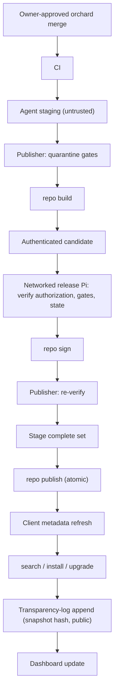

# aslice Build Infrastructure — One Harness, Two Scales

> State, identity, privilege, and recovery contracts: [STATE-AND-RECOVERY](STATE-AND-RECOVERY.md). Protected-volume patching: [SYSTEM-VOLUMES](SYSTEM-VOLUMES.md). These specifications do not establish completed implementation or platform validation.

- **Status:** Design draft, v0.25 — September 2026
- **Companion to:** [DESIGN.md](DESIGN.md), [PACKAGE-FORMAT.md](PACKAGE-FORMAT.md), [TOOLCHAIN.md](TOOLCHAIN.md)
- **Scope:** the build harness (`aslice build`), farm orchestration (`aslice farm`), scheduling, worker trust, the VM test matrix, and the pipeline from build result to published repository.
- **Vocabulary:** [NOMENCLATURE.md](NOMENCLATURE.md) — project terms, acronyms, and the Homebrew translation table.

---

Navigation: [1. The founding axiom](#the-founding-axiom) · [2. The harness: one binary, four modes, one sandboxed core](#the-harness-one-binary-four-modes-one-sandboxed-core) · [3. The pipeline, shared at both scales](#the-pipeline-shared-at-both-scales) · [4. User mode: `aslice build`](#user-mode-aslice-build) · [5. Farm topology](#farm-topology) · [6. Scheduling: plan, lanes, leases](#scheduling-plan-lanes-leases) · [7. Trust: owner merge authorizes processing, agents produce evidence](#trust-owner-merge-authorizes-processing-agents-produce-evidence) · [8. The VM test matrix](#the-vm-test-matrix) · [9. From result to repository](#from-result-to-repository) · [10. Farm-side metrics (the only kind there are)](#farm-side-metrics-the-only-kind-there-are) · [11. Failure modes, planned](#failure-modes-planned) · [12. Roadmap mapping](#roadmap-mapping)

<a id="the-founding-axiom"></a>

## 1. The founding axiom

**The farm is not a special system.** Every build the project runs goes through the machinery a user invokes with `aslice build`. Contributors can reproduce a job on a Mac with the required CPU, OS, and resources. Three properties follow from this axiom:

- **Debuggability.** A failing farm build can be reproduced locally with one command on a compatible machine, using the same pinned inputs and harness. Host and guest capabilities still matter (§6.1).
- **Resilience.** A farm outage costs binary *freshness*, never user capability: the farm's pipeline is the user's pipeline, so users can always build from source.
- **Trust.** Reproducibility cross-checks (§7) are volunteers running the same harness — no special access, no special build of the tooling.

The axiom is not free: the harness must serve an unattended fleet and a human at a keyboard equally well. Everything below is shaped by that requirement.

<a id="the-harness-one-binary-four-modes-one-sandboxed-core"></a>

## 2. The harness: one binary, four modes, one sandboxed core

```sh
aslice build <what>           # user mode: build one package (or a formula dir) locally
aslice farm plan              # coordinator: compute the build plan from an orchard
aslice farm coordinator       # coordinator: schedule → gate → collect
aslice farm agent [--once]    # worker mode: pull signed jobs, build, upload results
aslice farm agent --vm-guest  # guest mode: run tests inside a matrix VM (§8)
```

All four modes *orchestrate*; none executes package code itself. They always delegate execution to the privilege-separated helpers of [DESIGN §5.1](DESIGN.md#process-layout): `aslice-fetch`, `aslice-extract`, and **`aslice-build`**. The last runs Starlark under Seatbelt; the harness spawns it for each phase with that phase's policy profile. A user's shell and a farm agent invoke the same executor bytes.

<a id="jobs-are-closed-worlds"></a>

### 2.1 Jobs are closed worlds

Every farm execution of package-controlled build or test code runs in a disposable VM: official recipes, PRs, autobumps, and third-party orchards have the same boundary. Create an instance from a verified immutable image; mount authenticated inputs read-only; run phase-specific sandbox profiles; export results to untrusted staging; destroy the instance. Keep agent credentials, coordinator control channels, signing keys, timestamp keys, and publication authority outside package execution. The host agent validates guest results before authenticating its receipt.

Record image digest, harness digest, all input identities, worker identity, physical builder identity, and isolation lifecycle evidence in the [build-evidence contract](../schematics/json/build-evidence.schema.json). PR caches are separate from release caches. Reusable compiler outputs require authenticated complete input keys (recipe, sources, toolchain, dependencies, flags, image, and harness) and applicable validation gates; a PR result cannot seed a trusted release cache merely by matching its claimed key. VM isolation and cache admission require macOS integration tests before launch.

A **job** is the complete, self-contained description of one build:

```json
{
  "job_version": 1,
  "orchard":   { "repo": "aslice/orchard-core", "commit": "c3f7…" },
  "package":   { "name": "ffmpeg", "version": "7.1.0", "revision": 0,
                 "variants": { "x265": true }, "flavor": "v3", "min_os": "10.11" },
  "toolchain": { "build_id": "7c19…", "digest": "sha256:…", "url": "…" },
  "deps":      [ { "name": "x264", "build_id": "77aa10b2", "digest": "sha256:…", "url": "…" } ],
  "sources":   [ { "url": "…", "sha256": "40973d…" } ],
  "sandbox":   { "test_network": false },
  "resources": { "jobs": 8, "ram_gb": 8, "disk_gb": 20, "timeout_min": 90 },
  "repro_of":  null
}
```

A job pins toolchain, dependencies, sources, and recipe. Its manifest hash identifies the requested build inputs; it is not the hash of the result. The canonical artifact manifest determines `artifact_id` after building, and delivered archive bytes determine `blob_digest` ([STATE-AND-RECOVERY §1](STATE-AND-RECOVERY.md#compatibility-and-artifact-identity)). `aslice build --reproduce` and farm verification compare the same build inputs and evidence under §7.3, with mismatches quarantined rather than assigned an expected output identity.

<a id="results-are-the-jobs-mirror"></a>

### 2.2 Results are the job's mirror

```json
{
  "job_sha256": "…",
  "agent":      { "id": "mbp-2015", "key_fp": "…", "os": "12.7", "flavor": "v3" },
  "slice":      { "digest": "sha256:…", "size": 18112331 },
  "abi_report": "abi/ffmpeg-7.1.0-v3.json",
  "log":        "logs/ffmpeg-7.1.0-v3.jsonl.gz",
  "timings":    { "fetch_s": 4.1, "build_s": 412.7, "test_s": 38.0 },
  "provenance": { "builder": "aslice 0.9.1", "started": "…", "finished": "…" }
}
```

Timings feed the farm dashboard and the "build pain" prebuild signal ([DESIGN §9.4](DESIGN.md#what-gets-prebuilt)); they are measured on the farm, never on users' machines.

<a id="the-pipeline-shared-at-both-scales"></a>

## 3. The pipeline, shared at both scales

The phases are defined in [PACKAGE-FORMAT §6.1](PACKAGE-FORMAT.md#phase-model); what follows is the infrastructure behind each:

| Phase | Environment | Notes |
|---|---|---|
| fetch | network: declared hosts only; writes: job cache | resumable, hash-verified, mirror-aware; **the farm vendors every artifact it fetches** into the tree's `blobs/sha256/` (§9) — the archive of last resort for dead upstreams |
| verify | no network | source hashes + PGP where declared |
| unpack / patch | no network; build dir only | the fuzzed extractor helper (xar/cpio/tar) |
| configure / build | no network; toolchain + dep slices mounted **read-only into an isolated buildroot** | builds never see the user's live store or profile |
| install | DESTDIR staging only | |
| abi-scan | aslice's own code, always, unskippable | per-arch entries for universal vendor payloads |
| test | no network by default | `tests.star`; per-formula OS/flavor skip policy |
| pack | writes `.slice` + provenance + ABI report | |
| sign | **farm only, on the signing host** (§7) | local builds stay unsigned, `origin = local-build` |

Determinism is a property of the harness, not of the formula: `LC_ALL=C`, `TZ=UTC`, a pinned `SOURCE_DATE_EPOCH`, prefix-mapping, and a scrubbed environment ([DESIGN §9.5](DESIGN.md#build-provenance)). The toolchain slice mounts at its canonical store path, so `-ffile-prefix-map` output is byte-for-byte identical between farm and user builds.

For `type = "binary"` formulae, the same command runs the compressed pipeline (fetch → verify hash+signer → extract payload → abi-scan → pack). Declared grafts are extracted and hash-verified with the payload but never run by the harness — rehearsal is a farm job (§6.4), not a pipeline phase. The farm's `redistribute = true` slices come from exactly this path — and a user can dry-run a vendor repack locally, auditing what a vendor slice would contain before installing it.

<a id="user-mode-aslice-build"></a>

## 4. User mode: `aslice build`

```sh
aslice build ffmpeg                                # resolve like install, but always compile
aslice build ./orchards/core/ffmpeg                # build a formula directory (maintainer loop)
aslice build ffmpeg --variant +x265 --cflags="-O3 -march=native"
aslice build --reproduce ffmpeg 7.1.0 v3 2f4a9c1e  # rebuild a published slice, compare digests
aslice build ffmpeg --offline                      # air-gapped; pre-fetched sources only
aslice build ffmpeg --keep --shell                 # keep build dir; sandboxed shell at the failed phase
```

- **Results are first-class installs.** The output enters the store with `origin = local-build`, recorded flags, and the identity rules of [DESIGN §7.2](DESIGN.md#build-identity), interoperating with the prebuilt world through the ABI contract like any slice. `aslice install --build-from-source` and `--variant`/`--cflags` builds are, literally, this command followed by an install step.
- **Resource manners.** The default is `jobs = cores − 1` (override `ASLICE_BUILD_JOBS`); RAM/disk watermarks refuse builds that would thrash the machine; the build directory lives on tmpfs when RAM allows; ccache is keyed by complete authenticated recipe, source, dependency, toolchain, flags, flavor, image, and harness inputs under `cache/ccache`. A laptop stays usable while it compiles.
- **Failure UX.** Structured per-phase logs (`cache/build/<id>/log.jsonl` plus a rendered tail), `--resume-from <phase>`, and `--shell`, which drops you into the exact sandboxed environment at the failed phase. Maintainer iteration never requires re-fetching or re-unpacking.
- **Cleanup.** Successful build directories are deleted; failures are kept for 7 days (configurable) and swept by `aslice clean`.
- **No daemons.** Builds are on-demand processes; `farm agent` runs when the user starts it and not before. Nothing auto-launches, nothing phones home, nothing idles in the background.

<a id="farm-topology"></a>

## 5. Farm topology

[DESIGN §9.3](DESIGN.md#the-build-farm) lists the hardware; here each machine is given its role:

| Machine | Role |
|---|---|
| Owned 2013 Mac Pro (trashcan) | Primary production `v1`/`v2` builder and tester; coordinator; compatible OS-test VMs; restricted publisher VM |
| Owned 2015 MacBook Pro | On-demand `v3` builder and tester; additional `v1`/`v2` builds and independent rebuild checks; compatible `v3` OS-test guests |
| Existing root Pi | Offline 1-of-1 root signing and recovery authority |
| Existing release Pi | Automatic networked targets, snapshot, and slice signing; no package builds |

No new hardware purchase is required by this topology. CPU configuration, RAM, storage, and build/guest concurrency remain unspecified until measured during bring-up. Core 2 Duo smoke testing is optional future coverage, outside the owned inventory. Community Macs may supply reproduction evidence (§7.4); they are not assumed capacity.

### 5.1 Capability inventory and qualification

The [worker-capabilities schema](../schematics/json/worker-capabilities.schema.json) stores signed enrollment evidence separately from observations. A fixture is not enrollment or qualification. Established inventory is limited to these owned machines and intended roles:

| Physical machine | Intended coverage | Qualification still required |
|---|---|---|
| 2013 Mac Pro | v1/v2 builds and guests; no v3 execution | Exact CPU/features, OS, hypervisor, guest matrix, RAM, disk, build/test durations and safe concurrency |
| 2015 MacBook Pro | On-demand v3 and independent v1/v2 checks | Exact CPU/OS-enabled features, guest exposure, RAM, disk, durations and safe concurrency |

Inventory each physical identity, host and guest OS, image/hypervisor versions, cumulative CPU and OS register-state support, RAM/disk budgets, and measured build/test/VM preparation durations. Unknown measurements are null with `pending` qualification; do not enroll them as usable capabilities. Run feature probes and representative builds/tests inside each guest, retain receipts, then qualify only successful combinations. Requalify after CPU, OS, image, hypervisor, or resource-policy changes. Independent rebuilds require distinct qualified physical builders; two guests on one Mac do not count. A second independent v3 builder is missing and remains a release blocker wherever required. Procurement and volunteer enrollment are outside this update.

The coordinator is boring by design: one process on the Mac Pro, a SQLite queue, an orchard checkout. Its state is reconstructed from archived orchard commits, signed plans/results, enrollment and lease history, quarantine decisions, and gate evidence, as specified in [DATABASE](DATABASE.md#6-farm-coordinator). Git and result bytes alone do not preserve those decisions. Agents exchange jobs and results; they never share the coordinator database. The GitHub Actions integration is a thin adapter — a self-hosted runner job that executes `aslice farm agent --once` — so the system of record never depends on Actions semantics ([DESIGN §9.2](DESIGN.md#the-github-ci-problem)).

The **signing host** is a dedicated networked release Pi holding distinct targets, snapshot, and slice-signing keys. A separate offline root Pi holds the 1-of-1 root. Both use encrypted software keys and offline backups; KEY-RUNBOOK governs custody and recovery. The restricted VM on the Mac Pro is the **publisher**: it checks gates, delivers authenticated release candidates automatically, verifies returned signatures, stages complete releases, and activates them atomically. It holds repository credentials and the timestamp key only; build guests receive neither and cannot submit signing requests. The release Pi runs no package builds or supplied scripts. Shared-host compromise can corrupt evidence and publication and expose the timestamp key (§7.2); online signer compromise can authorize malicious releases. Offline root custody permits authority replacement but cannot undo installations or establish content safety. The Pis are existing devices; validate their OS and signing tools before launch. Initial setup and unlocking after signer restart may require the owner; routine releases require no intervention. These services remain implementation work.

<a id="scheduling-plan-lanes-leases"></a>

## 6. Scheduling: plan, lanes, leases

<a id="the-build-plan"></a>

### 6.1 The build plan

`aslice farm plan` computes the work: it diffs the orchard in git, expands each affected formula into jobs across its declared matrix — every flavor its `min_os` allows, with smoke tests for each OS release in `[min_os, 12]` — and topologically orders the resulting DAG.

Assignment requires detected CPU features, OS support for those features, validated guest capabilities, and available resources. Within the owned farm, complete `v3` jobs run exclusively on the laptop. A compiler can emit `v3` machine code on a weaker CPU, but configure probes, generated build tools, dependencies, and tests may execute it during the same job. Code generation alone does not establish that the package can build on the Mac Pro. Its VMs cannot supply the missing `v3` execution capability.

When the laptop is unavailable, `v3` work stays queued; eligible `v1`/`v2` jobs continue on the Mac Pro. Unsupported flavors are never assigned or silently substituted. Required OS/flavor tests and independent rebuilds without a capable worker remain pending. Capacity shortages do not narrow a formula's declared support or waive a gate. Resource values in example job manifests (§2.1) are illustrative, not measured capacity or concurrency commitments.

A recipe, source, toolchain, build-configuration, or selected dependency change invalidates the affected transitive consumer closure by default. This includes static libraries, headers, generated code, and bundled components, even when no exported ABI changes. Keep recipe edges (declared build/runtime/embedded inputs) separate from actual artifact bindings. Traverse both to find consumers; incomplete binding or component evidence keeps coverage unknown. Each rebuild records its triggering old/new input identities and dependency path and receives a new revision when required by package identity rules.

The ABI gate remains a compatibility check ([ORCHARD-POLICY §10](ORCHARD-POLICY.md#merge-gates-what-ci-must-prove)); a compatible ABI does not exempt a consumer from security remediation. Freeze and publish the complete authorized provider/consumer set atomically. Across orchards, coordinate separately authorized candidates; consumers outside the publisher's authority that cannot be rebuilt stay visibly affected in advisories and reports. Publication must not claim those consumers are fixed. [OBS transitive rebuild scheduling](https://openbuildservice.org/help/manuals/obs-user-guide/cha-obs-build-scheduling-and-dispatching) is an upstream precedent for dependency-driven rebuilding.

<a id="lanes"></a>

### 6.2 Lanes

Job kind and dispatch priority are independent. Kind is `build`, `test`, `rebuild`, `vendor`, or `graft`. Priority is `security`, `approved-release`, `freshness`, or `backfill`, in that order. Only authorized security incidents receive security priority. Non-security work continuously ready for 24 hours ages to approved-release priority; order that class FIFO by ready time, then job digest. A dependency becoming unready resets ready time; busy workers do not. Backfill uses the farm value signals in [DESIGN §9.4](DESIGN.md#what-gets-prebuilt), never download counts.

Dispatch only dependency-ready, authorized, non-quarantined jobs to workers whose qualified capabilities and free resources satisfy every requirement. Prefer capable non-v3 workers for v1/v2 work to preserve scarce v3 capacity. Distinguish `waiting-worker` (capable workers busy/offline) from `no-capable-worker` (no qualified worker), and list missing OS tests, independent rebuilds, and every other publication blocker.

Coalesce superseded queued jobs by authenticated input identity and logical matrix slot; retain the supersession record and replacement job. Running jobs finish unless explicitly cancelled. Cancellation terminates the disposable guest, revokes its lease, and retains logs, partial results, and a cancellation receipt; late results cannot satisfy gates. No arbitrary compiler checkpoint/resume is promised. Phase reuse requires verified complete inputs and a new disposable guest.

<a id="leases-not-locks"></a>

### 6.3 Leases, not locks

An agent leases a job and sends heartbeats to retain the lease. If the lease expires, an unresolved job returns to the queue with the same input identity; cancelled and superseded jobs stay terminal. A late result retains evidence but cannot satisfy a revoked or replacement lease. Results are keyed by job-manifest hash, so duplicate results are discarded. The system is idempotent, allowing the farm to resume after power is removed and restored.

<a id="pr-gates"></a>

### 6.4 PR gates

An orchard PR runs the changed formulae and their affected transitive consumer plan: lint → build every declared flavor → smoke-test every OS on the VM matrix → ABI gate if a provider → graft rehearsal if graft-bearing. Rehearsal runs each declared graft in the per-OS VM matrix under instrumentation and diffs observed writes, kext loads, daemon installs, and network access against the declared behavior manifest ([DESIGN §12.15](DESIGN.md#vendor-install-scripts-grafts--declared-approved-monitored-reversible)); a deviation or under-declaration fails the PR, and only an exact match lets the signing host sign the manifest into the index. Merge is blocked until green; automatic signing and subsequent publisher activation happen post-merge (§9).

<a id="trust-owner-merge-authorizes-processing-agents-produce-evidence"></a>

## 7. Trust: owner merge authorizes processing, agents produce evidence

<a id="quarantine"></a>

### 7.1 Quarantine

Every agent result lands in an **untrusted staging area**, and nothing from staging is ever served. The publisher prepares a release bundle only after:

1. lint/policy re-check of the formula at the job's orchard commit;
2. the independently rebuilt unsigned or normalized evidence matches where the reproducibility class demands it (§7.3);
3. the smoke test passed on the claimed OS × flavor;
4. the ABI report is sane (no unexplained fingerprint regressions);
5. the slice passes the malware-signature gate (§7.5) — scanned against current definitions, verdict recorded in its provenance;
6. for graft-bearing slices, the per-OS rehearsal receipts show exact matches against the declared behavior manifest, and the manifest itself is signed at promotion (§6.4) — no exact receipt, no promotion.

Missing required tests or independent rebuilds leave promotion pending; unavailable capacity is never a pass. Only then: `aslice repo build` prepares the bundle, the networked release Pi automatically verifies it and signs with `repo sign`, and the publisher re-verifies it before `repo publish` ([KEY-RUNBOOK §2.1](runbooks/KEY-RUNBOOK.md#automatic-orchard-to-client-publication)).

<a id="agents-are-expendable"></a>

### 7.2 Agents are expendable

An agent holds the coordinator's public key (unsigned or unknown jobs are refused), a per-agent Ed25519 identity for result signing, a dedicated `_aslicefarm` user, and Seatbelt phase profiles. Build guests hold no agent identity keys, publication credentials, or repository signing keys. The host agent authenticates result envelopes outside package execution; guest claims remain untrusted evidence. A compromised guest can falsify evidence or disrupt jobs; quarantine and independent rebuilds reduce that risk but do not prove arbitrary package code safe. A compromise that reaches the shared Mac Pro host or hypervisor can corrupt gate evidence, staging, and publication and expose the publisher's timestamp key. Root authority remains offline, but forged release evidence can mislead automatic verification; publisher authentication alone does not establish content safety. Treat this as a signing incident under [KEY-RUNBOOK §4](runbooks/KEY-RUNBOOK.md#compromise-response).

All package-controlled farm code, including official recipes, PRs, autobumps, and third-party orchards, runs in disposable VMs (§2.1). Seatbelt profiles remain an additional in-guest boundary; recipe approval does not grant host execution.

<a id="reproducibility-classes"></a>

### 7.3 Reproducibility classes

Not every package is bit-reproducible yet, and the record must say so. Each formula's provenance carries a class:

| Class | Meaning | Signing-host enforcement |
|---|---|---|
| `bitwise` | unsigned canonical build output must match across independent builds ([STATE-AND-RECOVERY §10](STATE-AND-RECOVERY.md#acceptance-and-implementation-order)) | hard gate: mismatch = quarantine + investigation event |
| `normalized` | matches after stripping known-nondeterministic sections (e.g. Mach-O Code Directory hashes, embedded UUIDs) | gate on the normalized comparison |
| `unreproducible` | known divergence, source recorded in the formula | tracked as debt; class upgrades happen only by orchard PR with evidence |

The two owned machines can cross-check `v1`/`v2` jobs on independent physical builders when both are available. They provide only one physical `v3` builder. A second VM or repeated run on the laptop is not an independent physical rebuild. Where the class or package policy requires an independent `v3` rebuild, promotion remains pending until a capable independent evidence builder is available; neither the requirement nor the class is weakened to fit capacity. This also applies to the scanner genesis requirement (§7.5).

<a id="community-builders--the-users-machine-enlisted-safely"></a>

### 7.4 Community builders — the user's machine, enlisted safely

The harness runs anywhere — so anyone can enroll a spare Mac:

```sh
aslice farm enroll --project https://farm.aslice.sh   # issues agent key, pins coordinator key
aslice farm agent --reproduce-only                     # verification jobs only, forever
```

A community agent receives only `repro_of` jobs: rebuild a staged or published job manifest and compare digests. Staged jobs allow required independent evidence to arrive before promotion (§7.3), including scanner genesis (§7.5). The results are **pure evidence** — agreement raises a slice's reproducibility confidence (feeding the `reproducible: true` badge of [DESIGN §9.5](DESIGN.md#build-provenance)); disagreement files an automatic investigation event. A community agent is never asked for, and never given, the ability to produce a served artifact.

The project gains a distributed rebuild network on the very machines the software targets; the volunteer gains dashboard credit and a warm Mac mini. This is "the farm must be runnable on a user's machine" answered at the trust level: **identical code, zero authority.**

<a id="the-malware-signature-gate"></a>

### 7.5 The malware-signature gate

Every staged slice is scanned against current ClamAV definitions before the publisher may include it in a release bundle. The gate exists for the two moments when the trust model is thinnest. The first is the autobump bot's **first fetch** of a brand-new upstream tarball: the hash is computed from that very fetch, so nothing has pinned it yet. The second is the **vendor-payload lane**, where bundled adware and PUPs are the documented pathology of the `.pkg`/`.dmg` ecosystem ([ORCHARD-POLICY §12](ORCHARD-POLICY.md#vendor-binary-packages-pkgdmg)). Each scan verdict — scanner version, definitions date, result — is recorded in the slice's provenance: every published artifact carries its receipt, and scan coverage is a dashboard number.

- **The scanner is the orchard's own `clamav` core package.** The farm dogfoods the orchard ([ORCHARD-POLICY §2](ORCHARD-POLICY.md#orchard-tiers-and-the-acceptance-bar): farm tooling is core by definition), running the same slice any user can install. Definitions refresh daily via freshclam on the farm network, and a scanner whose definitions are stale beyond 48 hours pauses promotion rather than scanning with dead signatures: the freshness of the gate is itself gated.
- **A detection quarantines the slice permanently**, files an investigation event, and pages the named maintainer. Nothing is auto-deleted, and nothing is auto-"cleaned": the verdict is a human decision. For vendor payloads the only options are rejection or a maintainer-documented exclusion in the formula, since a modified payload would break byte-integrity against the pinned signer.
- **Genesis is a documented exception, not a silent gap.** The pattern is the same one used for the toolchain genesis and the TUF root ceremony, applied to the chicken-and-egg of a scanner that is itself a package:
  1. The first `clamav` build is scanned by a **throwaway scanner**. A maintainer hand-builds ClamAV from the same hash-pinned, upstream-GPG-verified source inside a quarantined VM, scans the staged slice, and records the verdict with `scanner = "bootstrap-handbuilt"` in its provenance. The orchard package never scans itself into existence.
  2. The other five §7.1 gates carry their full weight for that first build: pinned and signature-verified sources, the sandboxed pipeline, owner approval under the single-owner policy ([ORCHARD-POLICY §17](ORCHARD-POLICY.md#governance-and-review-process)), and a hard `bitwise` reproducibility requirement with an independent evidence rebuild (§7.4) before promotion. The scanner gate is one layer of six; genesis is when the other five stand up straight.
  3. The gate's go-live — the first snapshot in which the packaged scanner runs the quarantine worker — is recorded in the transparency log. Slices published before it are marked `pre-gate` on the dashboard: annotated, never rewritten.
  4. **Backlog sweep.** The packaged scanner then re-scans every pre-gate slice against current definitions, *including its own origin slice*, and scan coverage climbs publicly to 100%. The origin slice's `bootstrap` receipt stays as-is.
- **Scope.** Signature scanning catches *known* malware — nothing more. Against a novel supply-chain backdoor it does nothing; that threat belongs to provenance, reproducibility classes, and review, and this gate changes nothing there. What the gate replaces on this platform is XProtect, which Apple no longer updates for 10.11–12: the farm maintains the definitions the built-in layer stopped receiving.
- **Client-side: nothing.** No scan-on-install machinery, no daemon, no definitions slice pushed at users. A user who wants on-demand scanning installs the same `clamav` package the farm runs and drives it themselves; the charter's no-telemetry, no-background-anything rules apply to security features as to everything else.

<a id="the-vm-test-matrix"></a>

## 8. The VM test matrix

Builds use the pinned toolchain and archived SDK on a capable worker ([DESIGN §4.3](DESIGN.md#toolchain-floor--self-hosted-from-day-one)); **tests run on the claimed OS and flavor.** The target matrix has seven releases: 10.11, 10.12, 10.13, 10.14, 10.15, 11, and 12. Run it in batches on the two owned Macs, with concurrency set only after measuring resources. Seven releases does not mean seven simultaneous guests.

Bring-up must validate the chosen hypervisor version, host OS, each guest's boot and test behavior, and CPU features visible inside it. VMware Fusion or Parallels are candidates, not verified configurations. The Mac Pro supplies compatible `v1`/`v2` guests; `v3` guests require the laptop and validated feature exposure. A guest cannot add CPU instructions the physical host lacks. Coverage remains planned until recorded by successful runs; an unavailable required OS/flavor combination blocks its gate.

- Each release has a golden image, snapshotted clean. A test run is: revert → boot → mount a read-only shared folder containing the staged slice → `aslice farm agent --vm-guest` executes `tests.star` → structured results out → revert. No guest has network beyond the coordinator wire; no state survives between runs.
- **Image genesis is documented and archived.** Per release: the Apple installer app → `createinstallmedia` (or the virtualization app's new-VM flow) → minimal install → golden snapshot. The installer apps are archived, with their sha256, in the farm's installer manifest: Apple can and does pull old installers, and the matrix must be re-creatable from nothing but the archive. Installers, images, and manifest are in the never-lose set ([GENESIS §3](runbooks/GENESIS.md#the-never-lose-set)).
- Archive validated images and their host/hypervisor requirements; revalidate after host or virtualization changes. Image retention does not establish continuing compatibility.
- Real Core 2 Duo `v1` smoke testing is optional future coverage. Neither owned Mac nor an OS VM establishes coverage of that older silicon.
- **Graft rehearsal rides the same matrix.** A graft-bearing install is rehearsed once per OS release the artifact targets: revert → boot → install under instrumentation → diff observed behavior against the declared behavior manifest → revert (§6.4). The no-network guest rule doubles as the graft's first exam question — a manifest declaring no network access rehearses with the wire off.

<a id="from-result-to-repository"></a>

## 9. From result to repository

The environment and release-version contract is [ORCHARD-POLICY §18.1](ORCHARD-POLICY.md#181-environments-branching-and-promoted-builds) and [ORCHARD-POLICY §18.2](ORCHARD-POLICY.md#182-release-versioning-and-unchanged-content-enforcement), for aslice and every orchard, including third-party orchards. For normal releases, build the candidate on `develop` (dev), then promote the identical artifact inventory to `beta` (staging) and `master` (prod) in the same repository. The flow below runs for the authorized destination environment; promotion reuses frozen artifacts and authenticated build receipts instead of scheduling new served builds. Destination tests and current security checks still apply. Branch merges that change release content require a new base version and a fresh dev candidate. Environment suffixes belong to external release metadata, never rewritten payloads. Operational configuration is supplied externally.



[KEY-RUNBOOK §2.1](runbooks/KEY-RUNBOOK.md#automatic-orchard-to-client-publication) specifies candidate contents, authenticated owner-merge authorization, retained signing state, serialized publication, and idempotent retries. Owner merge is the final human approval, including new core slices. Stale candidates must reconcile against current repository and signing state before signing again. The root Pi is not used for routine releases. The publisher refreshes timestamps daily for the valid approved snapshot; targets/snapshot renew automatically below 30 days using the last approved content. Root renewal and top-level key replacement remain offline operations ([KEY-RUNBOOK §1.1](runbooks/KEY-RUNBOOK.md#metadata-validity-and-renewal) and [KEY-RUNBOOK §3](runbooks/KEY-RUNBOOK.md#routine-key-rotation)). Client metadata refresh makes releases discoverable; publication does not force installation. Execute the end-to-end and failure drills in [KEY-RUNBOOK §7](runbooks/KEY-RUNBOOK.md#drills-and-acceptance) before launch.

Isolated security candidates use the [maintenance branch mapping](ORCHARD-POLICY.md#maintenance-releases), identical gates and inventories, and an expected production baseline checked under the activation fence. Maintenance does not require merging unrelated ordinary development.

The index snapshot is published atomically with its dependent rebuilds (§6.1). Those builds are part of the frozen dev candidate and are reused in staging and prod. Missing required flavor builds, tests, rehearsals, or independent rebuilds keep the affected publication set pending; laptop absence never permits a partial provider/dependent update. Retention follows [STATE-AND-RECOVERY §8](STATE-AND-RECOVERY.md#plans-locks-archives-and-offline-use): all published historical snapshots and their referenced hosted objects are retained under a currently authorized archive catalog.

The same publish deposits **every source artifact the build fetched** into the tree's `blobs/sha256/` area: the vendored-source archive ([DESIGN §9.6](DESIGN.md#the-repository-system)). Upstreams delete, reshuffle, and re-roll tarballs constantly. An orchard that vendors its sources never notices, and a from-nothing re-standup never starves ([GENESIS §2](runbooks/GENESIS.md#the-genesis-inventory)).

<a id="farm-side-metrics-the-only-kind-there-are"></a>

## 10. Farm-side metrics (the only kind there are)

No user telemetry exists anywhere in this system ([DESIGN §2.2](DESIGN.md#non-goals) N7). What the farm publishes concerns the **farm**: median days behind upstream (freshness health), build pain per package (feeds [DESIGN §9.4](DESIGN.md#what-gets-prebuilt)), reproducibility coverage percentage, queue depth per job kind and priority, per-OS × flavor test pass rates, fleet status. Include signing health: remaining root/targets/snapshot validity, root-renewal alerts at 30 days, automatic targets/snapshot renewal below 30 days, signer availability and renewal failures, and daily timestamp-refresh failures ([KEY-RUNBOOK §1.1](runbooks/KEY-RUNBOOK.md#metadata-validity-and-renewal)). All of it is computed from the farm's own operation and published on the static dashboard at **aslice.sh/dashboard**, the transparency surface of [DESIGN §13.4](DESIGN.md#governance).

<a id="failure-modes-planned"></a>

## 11. Failure modes, planned

[DATABASE](DATABASE.md#11-backup-sets-and-restore) defines coordinated backup boundaries for coordinator, publisher, and signer. Retain reservations, fence epochs, quarantine decisions, and publication evidence outside SQLite; keep independent off-site copies. Missing records do not become successful gates after reconstruction.

| Failure | Behavior |
|---|---|
| Agent dies mid-job | Lease expires, job requeues, partial staging ignored |
| Coordinator dies | Restore the coordinator records and evidence on a provisioned replacement, expire inherited leases, reconcile results and quarantine, then reconnect agents ([DATABASE](DATABASE.md#12-recovery-decisions-and-failure-matrix)) |
| Release Pi down | No new releases or automatic targets/snapshot renewals; daily timestamps may continue for valid approved metadata, but expired snapshot/targets metadata blocks updates; restore and drill before signing |
| Poisoned/faulty result | Quarantined forever; digest mismatch or class violation files an investigation event |
| Scanner detection (§7.5) | Slice quarantined permanently pending maintainer review; investigation event filed; promotion pauses if definitions are stale |
| Laptop unavailable | `v3` builds/tests and required laptop rebuild checks queue; eligible `v1`/`v2` work continues on the Mac Pro |
| Mac Pro down | Primary builds, coordinator, guests, preparation, and publication stop; root and release keys remain on their separate Pis. Recover coordinator and publisher state; replace a lost/suspect timestamp key through a root update. Updates fail closed when metadata expires |
| Required guest or CPU flavor unavailable | Affected work remains pending; no flavor substitution or assumed test pass |
| Required independent rebuild unavailable | Promotion waits for a capable independent builder, including for `v3` |
| VM host down | Its guests' tests queue; only work on surviving capable workers can continue; publication still requires all gates |
| Disk pressure | Watermarks pause agents; scheduled farm-side `clean` sweeps staging and caches |
| GitHub Actions changes | The adapter is disposable; the standalone coordinator is the system of record |

<a id="roadmap-mapping"></a>

## 12. Roadmap mapping

- **Phase 0:** the harness skeleton — `aslice build` local mode with the full sandboxed pipeline; toolchain-as-slice; job/result schemas; `farm plan`. The from-nothing sequence ([GENESIS §1](runbooks/GENESIS.md#the-from-nothing-sequence)) is executed end-to-end and written down as it runs: the project must be able to stand up from nothing, repeatedly, before it has users.
- **Phase 1:** coordinator + agents + leases; Actions adapter; VM matrix bring-up; PR gates for the core orchard; staging → quarantine → automatic networked signing → atomic publisher pipeline including the §7.5 malware-signature gate, bootstrapped per its genesis protocol, with the `clamav` core package the gate runs on.
- **Phase 2:** dependency-driven transitive rebuild cascades with ABI compatibility gates; vendor-repackaging lane including graft rehearsal (§6.4); backfill lane with [DESIGN §9.4](DESIGN.md#what-gets-prebuilt) priorities; public dashboard.
- **Phase 3:** two-machine `v1`/`v2` cross-checks for core; capable independent evidence builders for required `v3` rebuilds; community evidence builders (`enroll`, `--reproduce-only`); transparency log; reproducibility class upgrades as a standing program.

## History

<details>
<summary>Document revision history</summary>

| Version | Date | Changes |
|---|---|---|
| v0.25 | September 2026 | Specify dependency-driven security remediation, explicit update and origin decisions, and the applicable farm, maintenance, and evidence contracts. Supersedes ABI-only rebuild and cost-first selection policies where previously stated; runtime and measured acceptance remain pending. |
| v0.24 | September 2026 | Remove retired comparison references and competitive framing; retain aslice requirements and link their owning specifications. Align affected contract summaries where applicable. |
| v0.23 | September 2026 | Specify coordinator reconstruction sources and integrate separate coordinator/publisher/signer backup and recovery boundaries; agents continue using the job/result protocol. |
| v0.22 | September 2026 | Documentation audit repairs: contract summaries aligned; owner-approved namespace, rollback, GC, naming, prefix, and graft decisions applied where relevant; semantic anchors and explicit citations added. Runtime implementation and platform acceptance remain pending. |
| v0.21 | September 2026 | Consolidate revision notes into a collapsible history table; no specification changes. |
| v0.20 | September 2026 | prose rewrite of helper execution and job-lease recovery; no content changes. |
| v0.18 | September 2026 | owner merge becomes the final human release approval, with automatic signing on a dedicated networked Pi and serialized atomic publication. Automatic targets/snapshot renewal replaces manual renewal; the root remains offline. The manual-release design above is superseded. Services and acceptance drills remain implementation work (KEY-RUNBOOK §2.1, §7); schemas and client signature formats are unchanged. |
| v0.17 | September 2026 | **Superseded design record:** initial signing uses a single owner, separate offline root and release Pis, encrypted backups, and manual release batches. The Mac Pro VM prepares and publishes; multi-party custody and hardware tokens are deferred. KEY-RUNBOOK defines renewal, rotation, recovery, and pre-launch drills; prior custody requirements are superseded. |
| v0.16 | Not recorded | topology rewritten for the owned Mac Pro and on-demand MacBook Pro; capability scheduling, batched VM validation, pending gates, independent rebuild limits, and shared-host signing risk made explicit |
| v0.15 | Not recorded | TOOLCHAIN.md v0.1 joins the companions — §2's pinned toolchain slice is specified there; companion references refreshed — DESIGN v1.21, PACKAGE-FORMAT v0.16; no content change. |
| v0.14 | Not recorded | prose-fix pass — two throat-clearing connectives removed (§2.1, §7.3); gems kept deliberately ('The coordinator is boring by design', 'the matrix's marginal cost is electricity, not maintenance', 'identical code, zero authority'); companion reference refreshed to DESIGN v1.20; no content change. |
| v0.13 | Not recorded | graft rehearsal lands in the farm spec — §6.4's PR-gate chain gains the rehearsal gate for graft-bearing binaries (per-OS VM rehearsal, observed behavior diffed against the declared manifest, signing only on exact match — DESIGN v1.19 §12.15), §7.1's quarantine list gains the rehearsal-receipt gate as its sixth check (and §7.5's layer counts follow), §8's VM matrix gains the rehearsal run shape, §3's binary pipeline notes grafts are hash-verified but never run by the harness, and §12's Phase 2 names the rehearsal lane; companions refreshed (DESIGN v1.19, PACKAGE-FORMAT v0.15). |
| v0.12 | Not recorded | the project domain lands — the farm coordinator's canonical endpoint is farm.aslice.sh (§7.4) and the transparency dashboard's public home is aslice.sh/dashboard (§10), per the owner's layout decision of paths for humans and subdomains for machines (September 2026); companion references refreshed to DESIGN v1.17, PACKAGE-FORMAT v0.13; no content change. |
| v0.11 | Not recorded | companions refreshed to DESIGN v1.16, PACKAGE-FORMAT v0.12; no content change. |
| v0.10 | Not recorded | NOMENCLATURE.md vocabulary reference added to the header; companions refreshed to DESIGN v1.15, PACKAGE-FORMAT v0.12; no content change. |
| v0.9 | Not recorded | review pass — the three bare §9.4 references now name DESIGN §9.4 explicitly; companion references refreshed; no content change. |
| v0.8 | Not recorded | prose rewrite throughout — chapters reworded in the project's technical-writing voice; no content change. |
| v0.7 | Not recorded | editorial pass — prose revised for directness; no content change. |
| v0.6 | Not recorded | the genesis audit — every fetched source is vendored into the repository tree (§3, §9), VM golden-image genesis and the installer-app archive are specified (§8), and the from-nothing sequence lands as GENESIS.md (§12); companions DESIGN v1.9 / REVIEW v0.11. |
| v0.5 | Not recorded | the gate's genesis protocol — the first `clamav` slice is scanned by a throwaway hand-built scanner with a `bootstrap` receipt, the other four quarantine gates carry full weight, go-live is a transparency-log event, and the packaged scanner sweeps the pre-gate backlog including its own origin slice (§7.5). |
| v0.4 | Not recorded | the malware-signature gate — every staged slice is scanned against current definitions before signing-host promotion (new §7.5, §7.1 gate 5, §11 failure row, §12 Phase 1); the scanner is the orchard's own `clamav` core package (ORCHARD-POLICY v0.7 §2); client-side scanning stays the user's decision. |
| v0.3 | Not recorded | companion references refreshed — DESIGN v1.8, PACKAGE-FORMAT v0.6; no content change. |
| v0.2 | Not recorded | companion references refreshed — DESIGN v1.7, PACKAGE-FORMAT v0.6; all internal cross-references re-verified against current section numbering, no content change. |
| Not recorded | September 2026 | corpus review corrections: artifact identity, protected execution, durable recovery, trust persistence, replay, platform limits, and examples aligned with STATE-AND-RECOVERY and SYSTEM-VOLUMES. These are specification changes; runtime acceptance remains pending. |

</details>
