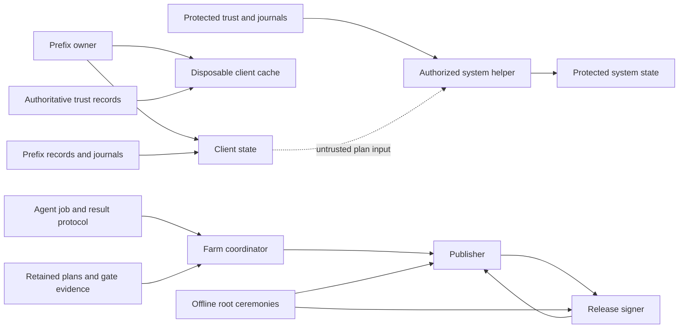
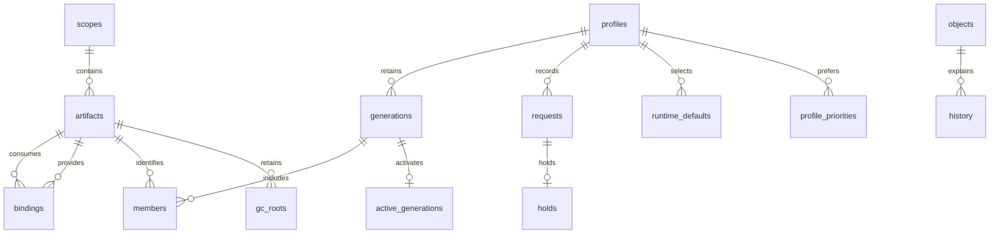
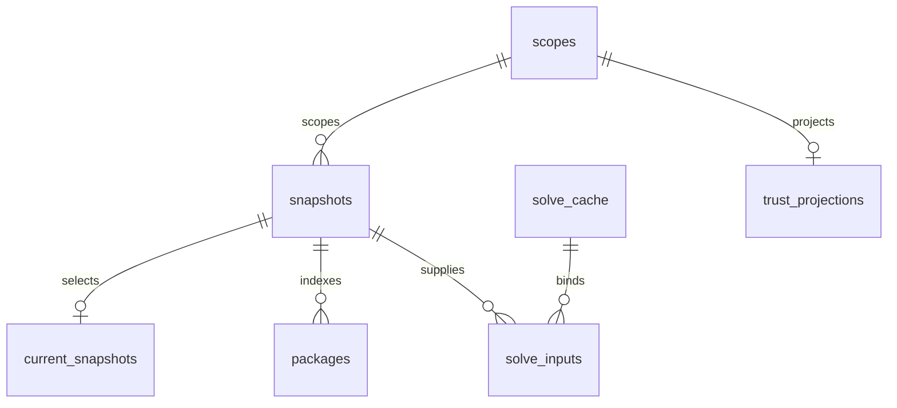
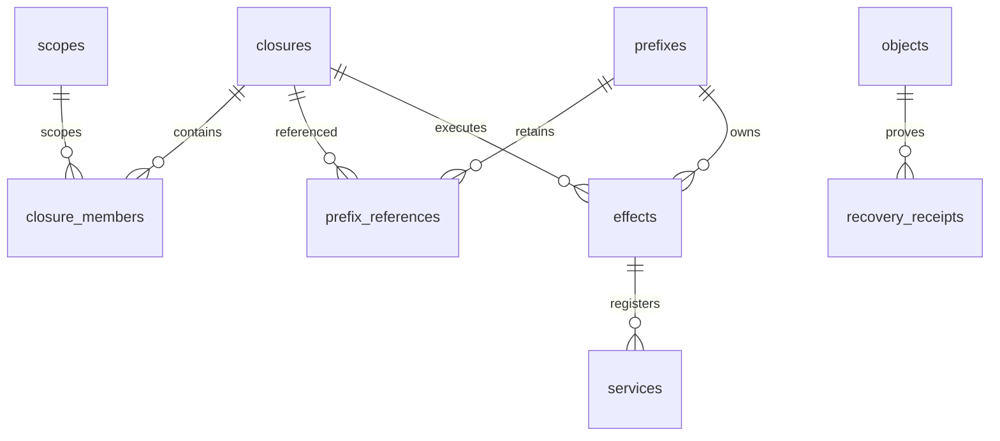
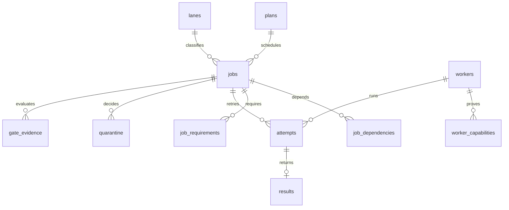
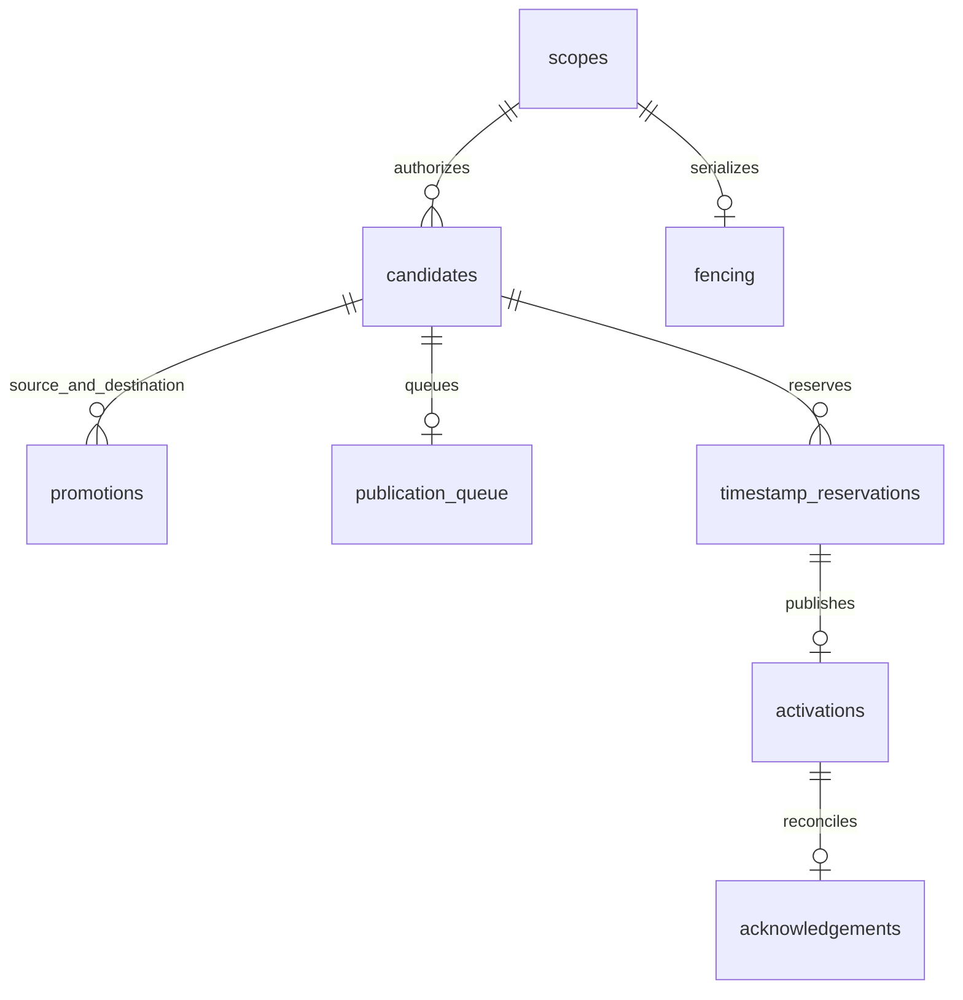
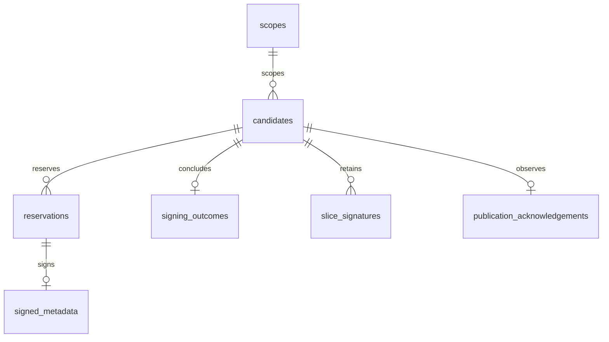
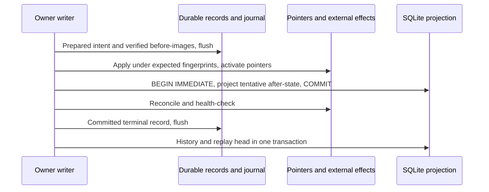
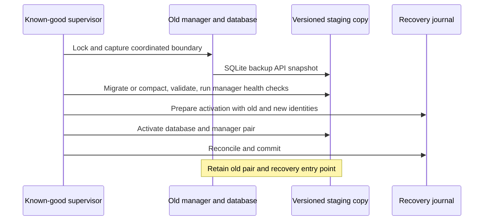
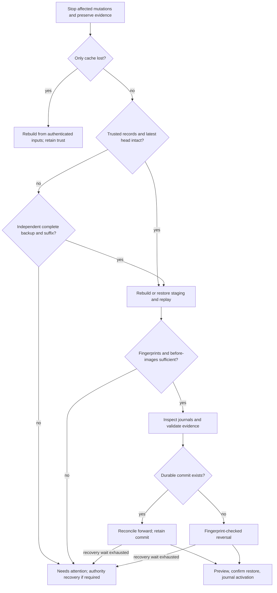

# SQLite storage and disaster recovery

- **Status:** Specification v0.2 — September 2026. The SQL and model tests are executable; database commands, services, migrations, and hardware recovery are not implemented.
- **Authority:** This document owns SQLite schemas, connection policy, reconstruction records, and database maintenance. [STATE-AND-RECOVERY](STATE-AND-RECOVERY.md) owns artifact identity, trust, privilege, and the transaction state machine. [KEY-RUNBOOK](runbooks/KEY-RUNBOOK.md) owns signing authority and compromise response.

## 1. Ownership and authority

SQLite stores projections of durable decisions and verified objects. It does not
establish trust, authorize privileged effects, or replace recovery journals. Each
owner has its own files and reconstruction stream. The offline root Pi keeps its
existing ceremony records; it gains no database. Farm agents exchange the existing
signed job/result protocol and never open the coordinator's database.



Arrows show data flow, not inherited authority. The helper authenticates a complete
closure independently. The publisher and signer independently enforce authorization,
gates, expected base, and environment. Their private keys and credentials remain
outside SQLite and outside database backup sets.

### 1.1 Files, owners, and creation

`<system>` is `/Library/Application Support/aslice/system`. `<coordinator>`,
`<publisher>`, and `<signer>` are absolute local service-state roots selected during
provisioning and recorded in owner-controlled configuration. They must be distinct
directories, even on a shared machine. A database path is never a network share.

| CLI role / SQL companion | Active location | Owner and access | Creation trigger |
|---|---|---|---|
| `client-state` / [schema](sqlite/client-state.sql) | `<prefix>/db/state.sqlite` | Prefix owner writes; that owner's manager, shims, and inspection read | Explicit prefix initialization |
| `client-cache` / [schema](sqlite/client-cache.sql) | `<prefix>/cache/db/cache.sqlite` | Prefix owner; fetcher and solver read/write | First authenticated refresh or solve |
| `system-state` / [schema](sqlite/system-state.sql) | `<system>/db/state.sqlite` | Root helper writes; authorized helper inspection reads | First authorized protected operation |
| `coordinator` / [schema](sqlite/coordinator.sql) | `<coordinator>/db/coordinator.sqlite` | Coordinator service account writes; authorized operator reads | Farm initialization |
| `publisher` / [schema](sqlite/publisher.sql) | `<publisher>/db/publisher.sqlite` | Publisher service account writes; authorized operator reads | Publisher provisioning |
| `release-signer` / [schema](sqlite/release-signer.sql) | `<signer>/db/signer.sqlite` | Release signer account writes; authorized operator reads | Signer provisioning after trusted-state import |

Directories use owner-only access (0700), database and sidecar files 0600, with
equivalent ACL restrictions. Root-controlled paths have no unprivileged-writable
ancestor. Check ownership, regular-file type, canonical location, and symlink
traversal before opening any database or sidecar. Database inspection does not
grant another role's permissions. Root launches the fixed helper vocabulary, never
arbitrary user SQL in the privileged process.

For protected inspection, the helper's fixed export operation produces only the
authorized diagnostic projection in a private inspection directory for the caller.
The caller runs SQL in an unprivileged, resource-limited inspection process. Service
operators similarly query owner-approved exports; they do not submit SQL over the
job/result or signing protocols. Exports retain role/instance/head identity and
their authorization scope, and are removed after inspection.

The paths above are logical active slots. Versioned copies live under the same
owner's `db/versions/<migration-id>/`; activation of the slot is journaled. Cache
versions live below `cache/db/versions/`. Schema creation alone does not initialize
an installation: the owner must insert `database_identity` before activation.

### 1.2 Identity and reconstruction

All six schemas have `user_version = 2`. Their `application_id` values, in table
order above, are 1095977985 through 1095977990. `database_identity` binds the role,
schema version, immutable 32-lowercase-hex instance identifier, and stable owner
identity. For clients the instance is the prefix identity; protected state has a
separate root identity. Services retain their provisioned identity across recovery.
Owner identity binds the provisioned principal and host/prefix record, not a UID
alone. Restoring onto a new host requires an authorized ownership mapping recorded
in the restore journal. Copying a database never creates a new prefix identity.

| Role | Reconstruction sources | Consequence of deletion |
|---|---|---|
| Client state | Prefix initialization record, compact choices/history, generation manifests, exact artifact manifests and materialization receipts, unresolved journals | Stop mutations and GC; shims report unavailable state until recovery establishes selections |
| Client cache | Currently authenticated index/recipe objects and separate trust receipts; fresh solver work | Rebuild on demand; retained trust and user choices are unchanged |
| System state | Protected initialization record, independently verified closure manifests, prefix registrations, effect journals, before-images, service declarations and receipts | Stop protected mutations and GC; preserve closures and reconcile actual effects |
| Coordinator | Archived orchard commits, signed plans/jobs, enrollment/capability evidence, attempts/results, quarantine and gate records | Stop dispatch; rebuild, expire old leases, then admit reconnecting agents |
| Publisher | Candidates, promotions, durable queue/fence records, timestamp reservations, exact signed objects, activation/acknowledgement evidence, current repository pointer | Stop all publication and refresh until the base and high-water state agree |
| Release signer | Trusted configuration/root chain, candidate bindings, every reservation including unpublished/consumed versions, signed objects and acknowledgements | Stop signing; reconcile independently retained latest public signing state |

None of these sources can regenerate lost unpublished payload bytes or missing
before-images. A retained manifest identifies missing bytes; it is not a backup of
them. Git plus build results cannot reconstruct quarantine decisions or signing
reservations.

## 2. Schema conventions

The six SQL companions contain the complete DDL: columns, types, keys, constraints,
indexes, and views. Run a companion only against an empty staging database. All
tables are `STRICT`. Primary and foreign keys deliberately include repository and
environment wherever a relation is scoped; a dev row cannot stand in for prod.
Repository strings are existing repository namespaces, resolved against retained
trust identity bindings; environments are `dev`, `staging`, and `prod`. Reusing a
namespace for a different trust identity requires explicit recovery, never an SQL
rename. Artifact identities remain `sha256:` plus 64 lowercase hex digits;
`build_id` remains 64 lowercase hex digits, as defined by
[STATE-AND-RECOVERY §1](STATE-AND-RECOVERY.md#compatibility-and-artifact-identity).
These schemas add no fields to public manifests, indexes, locks, or TUF metadata.

Every role contains five common tables:

| Table | Purpose and lifecycle |
|---|---|
| `database_identity` | Provisioning writes one row; every connection checks it against configuration, application ID, and supported schema before using projections |
| `maintenance_tasks` | Disposable per-task attempt/success/outcome bookkeeping; reconstruction marks every task due; excluded from logical digests and replay |
| `objects` | Verified digest, byte length, and descriptive kind for external immutable objects; importer inserts after hashing; inspection and reference validation read |
| `scopes` | Repository/environment pairs admitted by the owner; serves as the parent for scoped foreign keys, never a trust grant |
| `replay_head` | Last fully applied record sequence/digest; replay updates it in the same SQL transaction as the projection; cache leaves it at zero |

`objects` is a reference registry, not a blob store. Resolve digests through the
owner's fixed content-addressed object roots; no row supplies an arbitrary filename.
Store exact signed bytes, large manifests, backups, recipes, solver inputs/results,
and evidence outside SQLite. Hash and measure bytes again when consumed. Kind is
descriptive; the consumer validates the required format and semantic role. A digest
may serve multiple uses. Length and checksum do not authenticate a source.

SQL enforces structural invariants. Owner code additionally validates canonical
manifest hashes, package names against existing schemas, complete closures, DAG
acyclicity, required gate sets, monotonic reservations, state transitions, signatures,
and compare-and-swap conditions. Foreign keys cannot prove those properties. No
writer uses `INSERT OR REPLACE` to hide a conflicting identity. An identical retry
compares the complete immutable record; different bytes at the same identity stop
replay and retain both records as evidence.

## 3. Client state



Bindings join exact artifacts, including explicit cross-repository dependencies.
Each binding retains its dependency repository, environment, and qualified name;
there is no inferred cross-environment fallback. Manifests, rather than matching
`build_id` values, authorize the binding.

| Tables | Readers, writers, transaction boundary, and retention |
|---|---|
| `artifacts`, `bindings` | Store import verifies and inserts artifact identity, origin, full package-record reference, materialization receipt, and bindings together. Install/solver/why/leaves/GC read them; the external package record retains flags, variants, recipe, and compatibility requirements. Retain while reachable, including dependencies; delete only through journaled GC after checking every owner |
| `profiles`, `generations`, `members`, `active_generations` | Install, uninstall, upgrade, rollback, and machine apply project manifests and activation in one transaction after pointer operations. History, list, shims, and GC read. Retain generation rows while policy retains their manifests; pruning records the removal |
| `requests`, `holds` | Install/mark/uninstall and one-argument pin/unpin write durable choices even without a generation change. Autoremove/upgrade read. Clearing a choice requires an explicit record; dependencies remain distinguishable from requested roots |
| `runtime_defaults`, `profile_priorities` | Default and `profile prefer` journal changes together with their projections. Shims read defaults; generation construction reads the preferred qualified provider for each colliding name. A missing provider cannot silently win a collision. Session `use` and project pins remain outside this database |
| `history` | Every completed mutation or attention outcome inserts operation ID, command, time, outcome, before/after state digests, and terminal record. History/log read. Compact rows and their records remain indefinitely; verbose log retention is unchanged |
| `gc_roots` | Transactions, protected-reference synchronization, launch registrations, execution views, process leases, and backups register roots. GC reads the recursive `retained_artifacts` view and independently checks protected roots. Expiry alone never establishes process death; uncertain liveness retains the root |

User choices describe current intent independently of generation manifests.
Rollback applies the recorded target managed state under existing command semantics;
it does not erase later history. `before_digest` and `after_digest` may be equal for
a no-op and null for a failed operation without an established state. The history
sequence identifies its terminal record, not wall-clock ordering.

An operation that stops with `needs-attention` retains that history entry. Its
later authorized resolution has a new operation ID and references the earlier
record; it does not replace the earlier outcome.

Representative query (also exercised by the tests):

```sql
SELECT profile, repository, name, artifact_id, on_request
FROM installed ORDER BY profile, repository, name;
```

## 4. Disposable client cache



| Tables | Readers, writers, transaction boundary, and retention |
|---|---|
| `snapshots`, `packages` | Refresh imports a verified snapshot, receipts, and searchable package/recipe references together. Search/info and solver read. Cleanup removes eligible dependent rows in bounded transactions before removing the snapshot (§10.2) |
| `current_snapshots` | Authenticated refresh selects one current snapshot per repository/environment in the import transaction. Cleanup protects this reference and active work |
| `solve_cache`, `solve_inputs` | Solver stores the exact input and result object references together. The input digest binds all snapshots, recipes, installed bindings, requests/holds, OS/CPU, policy, configuration, and solver version. Recheck inputs and trust before reuse; a snapshot hash alone is insufficient |
| `trust_projections` | Authenticated trust reconciliation replaces descriptive projections. Repo inspection reads them; capability checks use authoritative `trust/` instead. Deletion conveys no revocation or grant |

All cache rows are disposable; routine cleanup protects current snapshots and
active work under §10.2. No cached verdict permits stale metadata, stale policy, or
offline use without the retained verification receipts required by
[STATE-AND-RECOVERY §8](STATE-AND-RECOVERY.md#plans-locks-archives-and-offline-use).
Search uses the indexed name column; FTS is not a schema dependency.

```sql
SELECT repository, environment, name, summary
FROM search_packages WHERE name LIKE 'python%' ORDER BY repository, environment, name;
```

## 5. Protected system state



| Tables | Readers, writers, transaction boundary, and retention |
|---|---|
| `closures`, `closure_members` | Helper imports independently verified closure inventory and authorization references. Helper service launch/rollback/GC read. Keep all active, retained, and unresolved closures |
| `prefixes`, `prefix_references` | Helper registers stable prefix identity, canonical path, UID, and active/retained/transaction references under the system lock. Cross-prefix GC consults these records; a missing client database does not release them |
| `effects`, `services` | Helper projects expected before/after fingerprints, backup metadata objects, unique managed targets, and launchd plist bindings. Services use the same closure as their owning effect. Reconcile one authorized transaction at a time; SQL state alone never triggers an external write |
| `recovery_receipts` | Helper records operation state and durable journal receipt in the same projection transaction. Recover/doctor/check read. Keep compact receipts indefinitely, including rolled-back and attention outcomes |

Effect and service rows describe the current managed footprint. Historical
fingerprints and declaration versions remain in durable records after replacement
or removal. Before-image objects include file metadata and an explicit absent-file
marker when appropriate. Resolved backup retention follows existing policy;
unresolved operations retain all before-images. No new database changes privileged
consent or system-volume requirements.

```sql
SELECT label, prefix_id, closure_digest, state FROM managed_services ORDER BY label;
```

## 6. Farm coordinator



| Tables | Readers, writers, transaction boundary, and retention |
|---|---|
| `plans`, `jobs`, `job_dependencies`, `job_requirements`, `lanes` | Farm plan inserts a complete authenticated DAG and requirements together. Scheduler reads dependencies and capability requirements; reject cycles and cross-plan edges. Job identity is the existing job-manifest hash |
| `workers`, `worker_capabilities` | Enrollment and capability verification project identity and evidence. Scheduler reads; agent self-report alone cannot establish a capability. Keep enrollment/revocation and capability history in records |
| `attempts` | Dispatch/heartbeat/expiry serialize under the coordinator writer. One active attempt per job; tokens are unique and expiry uses the coordinator's clock. Record attempt and lease before dispatch. After recovery mark every inherited active lease expired before redispatch; never trust restored clock-relative liveness |
| `results` | Result admission authenticates worker/attempt/job bindings and inserts once per job-manifest hash. Byte-identical duplicates return the retained result. Conflicting duplicates are retained in evidence and quarantined, never overwrite the accepted result. Expired attempts can supply evidence but cannot complete a replacement lease |
| `quarantine`, `gate_evidence` | Gate processing writes evidence references and append-only quarantine decisions together. Only an authorized release decision clears a hold. Required gates derive from retained policy, so absent rows mean pending. Signed job results alone do not establish a passing gate |

Compact scheduling, attempts, result identities, quarantine decisions, and gate
receipts survive indefinitely in records. Old SQL jobs may be archived only behind
a verified checkpoint; unresolved jobs and evidence remain available. Build logs
and payloads follow their existing retention policy. The coordinator's success is
not publisher authorization.

```sql
SELECT job_digest, attempt, worker_id FROM lease_status
WHERE expires_at <= :now ORDER BY job_digest;
```

## 7. Publisher



| Tables | Readers, writers, transaction boundary, and retention |
|---|---|
| `candidates`, `promotions` | Repo build verifies candidate, frozen inventory, authorization, and base. Promotion binds the same repository and inventory across dev→staging or staging→prod and requires successful source evidence. A new base or changed publication metadata gets a fresh candidate; immutable payload inventory cannot change under promotion |
| `publication_queue` | Publisher queues releases, unchanged-content renewals, and timestamp refreshes. A waiting candidate holds no writer lease. Queue transitions and corresponding records commit together |
| `fencing` | Publisher increments the durable epoch before handing out a writer. Activation checks epoch, unexpired ownership, and expected active snapshot under the publication lock. The repository activation adapter must reject stale epochs too; an SQLite comparison alone cannot fence an old remote writer |
| `timestamp_reservations` | Reserve monotonically per repository/environment before signing, including daily refresh. Bind exact unsigned bytes and candidate; save exact signed bytes before use. Consumed or interrupted versions are never reused, including after key rotation |
| `activations`, `acknowledgements` | Persist the observed atomic timestamp activation and delivery acknowledgement; inspect/recover reconciles the actual published snapshot and signer. Never infer publication from queue state or a signature alone |

All candidate bindings, reservations, fence epochs, promotions, and publication
evidence are retained indefinitely in compact records. SQL history may move behind
verified checkpoints but active queue/base and all version high-water projections
remain available. Current and in-flight immutable public objects follow repository
retention. Compare returned signer state with retained public records on every
recovery; uncertain latest state stops publication.

```sql
SELECT repository, environment, queue_sequence, state, snapshot_digest
FROM publication_status ORDER BY repository, environment, queue_sequence;
```

## 8. Release signer



| Tables | Readers, writers, transaction boundary, and retention |
|---|---|
| `candidates` | Signer admission independently verifies candidate digest, authorization, inventory, expected base, and trusted policy before projection |
| `reservations` | Signer durably reserves targets/snapshot versions and exact unsigned bytes before invoking keys. Same version/different bytes is a refusal. Interrupted reservations resume only identical bytes or become consumed. Highest reserved, not merely highest published, is the floor |
| `signing_outcomes`, `signed_metadata`, `slice_signatures` | Store exact returned metadata and detached slice-signature references, with outcome, before returning a response. A retry returns saved bytes. A signed outcome requires every required object; enforce this semantic check before response |
| `publication_acknowledgements` | Authenticated publisher receipt and independently checked repository state establish the last published base. Lost acknowledgement triggers reconciliation, not another signature at an old version |

Keep every reservation, candidate binding, outcome, exact signed object, and
acknowledgement indefinitely, including rejected and signed-but-unpublished work.
Private key operations remain in the existing signer boundary. No key blob,
unlock secret, or key-backup path is a column. Root signing remains offline and is
not represented by this database.

```sql
SELECT repository, environment, metadata_role, version
FROM version_high_water ORDER BY repository, environment, metadata_role;
```

## 9. Durable records and replay

Each durable role has an owner-controlled `records/` stream beside `db/`; existing
transaction journals and `trust/` remain authoritative in their own locations.
Records describe logical state transitions, never raw SQL. The cache has no stream.
Protect streams with the same ownership boundary as their database and retain
compact history indefinitely. Checkpoints accelerate replay; they do not authorize
discarding compact records.

A record is canonical RFC 8785 JSON with these fields: `format` (1), `role`,
`instance_id`, `sequence` (positive safe integer), `previous` (prior record digest,
null only for sequence 1), `operation_id` (32 lowercase hex digits), `phase`,
`command`, `occurred_at` (UTC epoch seconds), `scope` (repository/environment or
null for an instance-wide operation), `before`, `after` (logical state digests or
null), `changes`, and `evidence`. `changes` is an ordered array of typed domain
operations with complete before/after values, including explicit deletion markers;
`evidence` is a sorted, duplicate-free array of digest/byte-length references.
Record identity is SHA-256 of the canonical bytes, stored separately from the
bytes themselves. Names are `<sequence>-<digest-hex>.json`. Initialize the stream
with owner/instance identity and empty state before admitting mutations.

Domain operations cover generation/member/binding changes, request marking and
removal, holds, defaults, profile priorities, GC references, effect/service and
prefix registration, farm enrollment/plan/attempt/result/gate/quarantine changes,
candidate/promotion/queue/fence changes, reservations, signing outcomes, and
activation/acknowledgement receipts. Each kind has a versioned decoder and validates
against its owning contract; unknown kinds or formats stop replay. Trust changes
reference independently authenticated trust records rather than embedding a grant
in an ordinary choice record. Session selections and project files are not replayed.

The writer serializes stream allocation under the role lock. It writes a temporary
record, flushes it, renames to its final name without replacement, flushes the
directory, and advances a flushed stream-head record containing sequence/digest.
Validate both the head and all finalized tail files: a crash between rename and
head update may leave a valid contiguous tail to recover. Duplicate sequence with
different bytes, gaps, broken predecessors, unsupported formats, or an operation
with incompatible terminal outcomes produce `needs-attention`. Checksums detect
damage; independently retained heads/backup manifests detect a truncated tail.
Local checksums alone cannot prove that an attacker did not rewrite user-owned state.

### 9.1 Commit boundaries



Preserve prefix-then-system lock ordering for operations touching both owners.
Service roles serialize through their own owner locks and existing publication
protocol; there is no transaction spanning WAL databases. Cross-owner journals bind
the same operation and participant receipts. Missing participants prevent success.

The durable terminal record is the commit decision. A choice-only operation uses
the same prepared/terminal discipline without generation or pointer changes.
Before returning success, both terminal record and final SQL projection must be
durable. SQL may temporarily lead or lag the record stream; every opener checks for
an unresolved journal or head mismatch before exposing shim/installed state.
Read-only diagnostic commands may report the mismatch but cannot treat it as a
committed selection. If the terminal commit is absent, recovery reverses effects
and tentative choices under the existing fingerprint rules; committed operations
reconcile their after-state. SQL rollback alone does not undo filesystem changes.

Reservations and fence allocations are special irreversible decisions: their
flushed allocation records consume the number even if the enclosing operation
never commits. Append these before any signature or writer handoff. An abandoned
candidate records consumption; replay never releases its versions. Quarantine
holds are similarly retained until an explicit authorized release record. Missing
gate evidence remains pending.

Contention and cancellation follow [§10.1](#101-contention-and-safe-stopping),
including committed operations whose SQL projection remains incomplete.

### 9.2 Replay and checkpoints

Replay verifies identity, format, sequence, predecessor, checksum, byte length, and
trusted external references before applying a record. It applies one complete
logical transition and its head in one SQL transaction. Replaying an already
applied sequence with the same digest is a no-op; another digest is a conflict.
Require the transition's before-state to match the reconstructed state. Terminal
history inserts once by operation ID. A prepared operation without a terminal
decision is unresolved, not silently dropped. Rebuild into staging and run recovery
against real pointers and fingerprints before activation.

A checkpoint binds role/instance/schema, manager and SQLite build identities,
sequence/head digest, logical projection digest, checkpoint object digest/length,
and the retained-record range it covers. Authenticate its provenance through the
owner's independently retained backup inventory; a checkpoint supplied by an
untrusted database is not evidence. Verify its prefix records and replay its suffix.
Unknown or conflicting high-water provenance forbids signer/publisher resumption.
No replay reconstructs a TOFU decision or lowers retained trust versions.

## 10. SQLite connection and migration policy

Bundle a pinned SQLite **3.51.3** source release, or an explicitly reviewed newer
fixed release, with the manager and service builds. The release manifest must pin
the source checksum, `sqlite_source_id()`, compiler options, and VFS build; those
build artifacts remain implementation work. Do not link legacy macOS system
SQLite. SQLite's [WAL documentation](https://sqlite.org/wal.html#walreset) identifies
the WAL-reset corruption fix in 3.51.3 and backports; the project baseline uses the
fixed mainline. See the [offline SQLite account](refs/SQLITE_STORAGE_AND_RECOVERY.MD).

Minimum schema features are STRICT tables (3.37.0), foreign keys, recursive CTEs,
partial indexes, and the online backup API. Production readers must use the pinned
fixed build as well as understand role/schema 2; accepting STRICT syntax alone is
not sufficient. Schema-test Python may use another SQLite build and reports its
version; that is not a production qualification. Older managers may open only
their retained compatible database copy. Unknown application IDs, schema versions,
or identity mismatches fail before domain queries; `db schema` may show the shipped
schema without opening a damaged database.

Every writer connection checks `journal_mode=WAL`, enables `foreign_keys=ON`,
`trusted_schema=OFF`, and uses prepared statements with bound data. Durable roles
use `synchronous=FULL`; only the cache may use `NORMAL`. On macOS enable
`fullfsync=ON` and `checkpoint_fullfsync=ON` and verify the selected VFS and
filesystem's behavior in platform acceptance. Unknown/ignored required settings
are a refusal. Durability still depends on the storage stack. The
[PRAGMA reference](https://sqlite.org/pragma.html#pragma_synchronous) explains the
FULL/NORMAL distinction; defaults are not a project configuration policy.

Use short `BEGIN IMMEDIATE` write transactions after acquiring domain locks. Use the
shared lock-wait allowance as specified in §10.1; expiry reports `db_busy` and
resolves the durable phase before releasing ownership. Replan on a stale base;
never repeat external effects merely because SQL returned busy. Surface disk-full
and I/O errors, stop mutations/GC, preserve sidecars and journals, and determine
the durable phase through recovery.

Autocheckpoint at 1,000 pages; attempt PASSIVE checkpoint after a batch and on idle.
Inspect WAL growth and busy readers. Owner maintenance can request RESTART/TRUNCATE
only after readers drain; it must report an incomplete checkpoint. Query readers
have a 5-second deadline and 10,000-row/16-MiB output limit. Do not delete WAL/SHM
files manually or copy only the live main file. These choices follow the
[WAL concurrency and checkpoint rules](https://sqlite.org/wal.html).

Inspection opens an owner-produced consistent snapshot read-only, never marks a
live database immutable, and enables defensive mode, query-only, disabled trusted
schema, and disabled extension loading. Prepare exactly one statement with no
non-whitespace tail. The authorizer permits SELECT/READ/RECURSIVE and an explicit
side-effect-free built-in function allowlist; deny ATTACH/DETACH, all PRAGMAs,
transactions, writes, DDL, virtual-table creation, and extension/file/network
functions. Apply SQL length, memory, expression-depth, and execution limits.
`db schema` and `db check` use separate fixed statements. `sqlite3_stmt_readonly()`
is an additional check, not the authorization policy. Use the
[SQLite security guidance](https://sqlite.org/security.html) and
[authorizer API](https://sqlite.org/c3ref/set_authorizer.html); runtime enforcement
and adversarial tests remain required.

### 10.1 Contention and safe stopping

Foreground commands use `db.lock_timeout = "30s"`; the common
`--lock-timeout DURATION` option overrides it for one invocation. Accept a
nonnegative integer followed by `ms`, `s`, or `m`; reject other forms and overflow.
`0s` tries once without waiting. One operation controller counts cumulative
lock-wait time across prefix, system, service-owner, and SQLite waits. Useful work
does not consume this allowance, and entering another layer does not reset it.
Use monotonic elapsed time and cancellable backoff starting at 10 ms, doubling to
a 250 ms cap and clipped to the remaining allowance. Preserve prefix-then-system
ordering. After one second of cumulative waiting, print a stderr waiting message;
update every five seconds thereafter with role, operation, elapsed wait, and known
owner identity. Say `unknown` when the owner cannot be established; a PID alone
does not establish authority. JSON output remains one object, with progress on stderr.

Owner-lock contention and SQLite `BUSY` consume the same allowance. SQLite may
return busy without invoking its busy handler, so the operation controller handles
every result; a connection-local timeout cannot implement this contract. Enable
extended result codes. For `BUSY_SNAPSHOT`, end the stale read transaction and
revalidate/replan before any effects; after effects begin, enter recovery instead.
For internal `LOCKED` conflicts, finalize conflicting statements or end the local
transaction and diagnose the connection error; do not sleep and retry blindly.
Disable shared-cache connections. Finalize statements and end read transactions
promptly. Runtime shims fail promptly when required state is unavailable and do
not inherit foreground mutation waits. See the
[SQLite contention evidence](refs/SQLITE_STORAGE_AND_RECOVERY.MD#contention-and-maintenance).

Normal commands bypass a busy disposable cache when authenticated inputs are
available: verify receipts, freshness, policy, and complete solver inputs as usual,
work in memory, and skip cache writes. Without those inputs, report unavailable
verified data; contention never authorizes stale or unverified use. Explicit cache
inspection or maintenance reports contention rather than substituting another
data source.

Timeout and cancellation are resolved by durable phase, not by the last SQL call:

| Durable phase | Timeout or cancellation outcome |
|---|---|
| Before preparation or external changes | End SQL work, release locks, report no managed-state change |
| Prepared, no live effects | Resolve prepared intent as aborted/rolled back before releasing ownership |
| External effects begun, no durable commit | Stop forward execution; enter fingerprint-checked recovery; never replay external effects because SQL was busy |
| Durable commit exists, projection incomplete | Preserve the commit decision and reconcile forward; report committed with recovery pending if reconciliation cannot finish |
| Complete, optional maintenance busy | Preserve foreground success and defer maintenance |

Recovery receives one separate, bounded 30-second cumulative lock-wait allowance,
including resolution of prepared intent; it is not renewed by retries or repeated
cancellation. Cancellation requests a safe stopping point, not abandonment of
effects. If recovery cannot finish, retain journals, backups, and GC roots, report
`needs-attention`, and block subsequent mutations. A committed operation cannot
be described as rolled back merely because cancellation arrived late.

Contention with no unresolved recovery exits 4; recovery-required outcomes exit 1;
safely completed cancellation exits 130. Optional maintenance after completed work
preserves exit 0. Diagnostics in `data` expose `phase` (`unprepared`, `prepared`,
`effects`, `committed`, or `complete`), `committed` (boolean), `recovery_required`
(boolean), and `retry_safe` (boolean). Retry is safe only after resolution and base
revalidation; committed work must not be resubmitted as a fresh mutation.

### 10.2 Automatic maintenance and cleanup

Run maintenance after successful mutations and in existing service idle loops.
Add no client daemon or launchd job, and never request elevation solely for
housekeeping. Attempt owner and SQL locks without waiting, yield to foreground
work, and share a 100 ms work budget across tasks. Check a monotonic deadline
between tasks and batches and use an SQL progress handler to interrupt work.
This limits scheduling and interruptible SQL, not the wall-clock duration of
storage synchronization. An interrupted batch rolls back; completed batches remain.
Optional maintenance failures do not undo command success; report corruption or
I/O failures separately and block later mutations when database health is uncertain.

Attempt cleanup hourly, optimization daily, and `PRAGMA quick_check` weekly when
due. Keep PASSIVE checkpoint attempts after batches and on idle; readers that
prevent completion leave checkpoint work deferred. Rotate due tasks by oldest
attempt (null first, then task name) so a cleanup backlog cannot starve another
task. A deferred or interrupted task remains due; each invocation tries it at most
once. Use bounded `PRAGMA optimize` with the pinned build's analysis limit and the
same progress deadline. Full integrity and external-reference checks belong to
`db check`; a quick check is not proof of reference or trust validity.

`maintenance_tasks` records UTC epoch seconds for last attempt and last success,
outcome, and deferred reason. Success advances only after the whole task completes;
a partial checkpoint or cleanup backlog is deferred. Bookkeeping is disposable,
excluded from logical-state digests and authoritative replay. Reconstruction seeds
all tasks due. If locks prevent writing an attempt, retain that observation in
memory and report it; flush it on the next writable opportunity, without waiting
solely to record a deferral. A backward clock jump clears future bookkeeping times
and makes tasks due rather than suppressing them indefinitely. These local records
are not telemetry.

Cleanup transactions delete at most 100 rows total, including dependent rows.
Large snapshot projections are removed in bounded child batches while owner
coordination protects current snapshots and active work; parent rows survive
until all references are gone. No cascading delete may evade the batch bound.
Before removing children, set the solve or snapshot's `cleanup_pending` marker
under exclusive owner coordination. Marked entries cannot be selected as current,
reused by solves, or exposed by search, even after interruption. The search view
excludes marked snapshots; owner code enforces the other selection rules. Complete
authenticated reimport may clear the marker atomically. This keeps a partially
removed projection from appearing complete between batches.
Cache `inserted_at` and `accessed_at` are UTC epoch seconds; initialize them on
authenticated insertion and coalesce access updates during writable operations.
Inspection never writes access times. In-memory active-work pins protect the
owner's readers even when timestamps have not been flushed. Other processes hold
shared owner coordination while consuming cache rows; cleanup requires exclusive
coordination and defers if those readers remain. Revalidate eligibility under the
lock. Access timestamps never move backward; retain future timestamps after a
clock correction until their age can be established conservatively.

| Role | Eligible cleanup and retained material |
|---|---|
| Client cache | Remove unused solves and superseded snapshot projections when last access is at least 30 days old (30 × 86,400 seconds). Protect `current_snapshots`, active work, and snapshots still referenced by retained solves. Expiry is a verification rule, not cleanup authority |
| Client/system state | Remove obsolete projections only after governing GC, decommission, or recovery has authorized removal. Expiry alone does not release process or protected references; compact history and recovery receipts remain |
| Coordinator | Lease expiry belongs to scheduler recovery. Completed jobs, attempts, quarantine decisions, and evidence do not become disposable through age; archival requires retained records and the existing authorized boundary |
| Publisher/release signer | Preserve reservations, version floors, candidate bindings, signing outcomes, and publication evidence indefinitely. Stale candidates do not authorize erasing history |
| All roles | Remove object-registry rows only after checking every SQL and retained external reference. Housekeeping deletes no external payloads, trust records, compact history, or recovery evidence |

### 10.3 Manual maintenance, compaction, and schema 2

`aslice db maintain [--dry-run]` runs eligible cleanup, optimization, lightweight
checks, and checkpoint work for the selected role. It uses the foreground lock
allowance and cancellable bounded batches, without the automatic 100 ms total
budget. It reports remaining/deferred work rather than claiming completion.
`--dry-run` inspects and reports eligibility and work estimates without writes,
including bookkeeping. It grants no authority to remove protected references.

`auto_vacuum=NONE` is explicit in every schema. Cleanup removes eligible rows;
deleted pages remain reusable inside the file. Checkpointing transfers WAL pages,
optimization updates planner information, and compaction reclaims database-file
space. None substitutes for another. Only `aslice db compact [--dry-run]` requests
full compaction; automatic maintenance never vacuums.

Compaction uses the versioned-copy mechanism below. Under owner coordination,
capture a consistent backup, vacuum the staging copy with no open statements or
transaction, validate logical equivalence, identity, replay head, integrity,
foreign keys, and external references, then journal activation. Keep the owner
boundary through activation; drain/reopen readers against the selected version.
Preserve the original database and known-good recovery entry point. Before work,
report snapshot size, vacuum workspace, retained-original size, and free-space
requirements per filesystem. Reserve space for the snapshot plus up to twice its
size for vacuum workspace, in addition to the retained original and measured
sidecars/journal margin; refuse insufficient space. `--dry-run` reports the estimate
without staging or activation. Failure before activation leaves the active file
intact; interruption during activation enters existing journal recovery. No
filename or modification time decides which copy is active. See the
[VACUUM evidence](refs/SQLITE_STORAGE_AND_RECOVERY.MD#contention-and-maintenance).

All six internal schemas advance from 1 to 2 without changing application IDs or
public formats. Migrate through a validated copy, never by editing the active file.
Rebuild `database_identity` with its version-2 constraint, preserve instance/owner
and all domain rows, and add seeded maintenance tasks. Cache lifecycle timestamps
start at migration time (not fabricated historical access); rebuild current-snapshot
references from authenticated current inputs, refusing activation if these cannot
be established. Unknown cache rows may instead be discarded and reimported after
verification. Compare logical state excluding maintenance bookkeeping and cache
lifecycle fields; validate every retained reference and both version markers.



Migrations run on a versioned copy, including migrations that appear additive.
Validate integrity, foreign keys, semantic equivalence, replay cursor, object
references, and manager health before journaled activation. No destructive in-place
migration is permitted. Failure preserves the old pair. Downgrade after new writes
requires an explicit compatible replay/conversion path; selecting an old snapshot
must not erase newer choices, reservations, or trust. Without that path refuse.

## 11. Backup sets and restore

A backup set is a consistent SQLite snapshot plus the durable material required to
interpret it. Use SQLite's [online backup API](https://sqlite.org/backup.html) into
a new staging file; check every API result and require completion. Raw copying of a
live main file is unsupported. A local snapshot supports operator-error recovery;
disk/site loss requires independently verified copies on separate storage and at
a separate location, following the [never-lose set](runbooks/GENESIS.md#the-never-lose-set).

### 11.1 Coordinated boundaries

| Set | Barrier and required participants |
|---|---|
| Prefix | Prefix mutation lock; resolved transactions, generation/choice head, trust-state checkpoint, referenced store/manifest/materialization objects, and local effects/backups |
| Prefix with protected effects | Prefix then system lock; one boundary ID plus both owners' heads, protected closures, prefix references, journals, before-images, and service declarations. Root material stays in a separately protected component |
| System | System lock after any participating prefix locks in canonical prefix-ID order; root trust, every prefix reference, unresolved journals and closures. Never discard references to unavailable prefixes |
| Coordinator | Stop dispatch and record admission at a known sequence; plans, enrollment, attempts, results, quarantine, gate policy/evidence. Exported leases are treated as expired on recovery |
| Publisher and signer | Pause publication, renewal, timestamp allocation, and signing admission; capture both heads, reservations, fence high-water, exact signed objects, current repository pointer and acknowledgements. A disconnected signer leaves the set incomplete for signing recovery |
| Cache | One consistent snapshot only, optional; no recovery authority and no need to preserve solves |

A standalone role backup is still useful but must name missing participants. It
cannot claim whole-prefix or signing recovery completeness. Quiesce at a resolved
boundary where possible. If an operation cannot resolve, retain its complete
prepared intent, phase receipts, and before-images and mark the set `recovery-required`.
Never wait for another owner while holding locks in reverse order.

The version-1 canonical JSON backup manifest binds `set_id`, creation time, status,
each role/instance/owner, application/schema IDs, manager/SQLite source identities,
database digest/length, stream sequence/head and retained ranges, trust checkpoints,
active pointer fingerprints, all required object digests/lengths, participant
boundary IDs, and any unresolved operations or missing components. Include restore
tool identities and compatible manager/database pairs. Verify all objects before
flushing and finalizing the manifest; store its digest in the independent backup
inventory. Interrupted copies have no finalized manifest and are not restorable
sets. Encrypt private administrative records in transit/storage as required by
their owner; database backup contains no private keys. Key backup follows the
separate runbook.

### 11.2 Ordered restore procedure

1. Stop the affected writers and GC/dispatch/publication. Preserve damaged files,
   WAL/SHM, journals, configuration, and pointers as evidence. Record incident and
   selected backup identities; do not overwrite originals.
2. Authenticate the backup manifest against the independent inventory. Establish
   the latest retained heads from live records, other copies, and counterpart
   receipts. A stale backup is usable only with a continuous verified suffix to
   the known latest state. If latest state cannot be established, refuse automatic
   restore rather than treating absence as an empty history.
3. Restore into a new owner-controlled staging directory. Check permissions,
   symlinks, role/instance/schema, manager compatibility, manifest checksums/lengths,
   `integrity_check`, `foreign_key_check`, all object references, trust provenance,
   record continuity, and domain invariants. Refuse mixed repository/environment
   identities and missing required participants. Preserve the prior active pair.
4. Replay the verified suffix and reconstruct missing projections. Reconcile
   incomplete transactions against actual filesystem pointers and fingerprints,
   including protected effects. Conflicting external edits or missing before-images
   produce `needs-attention`; never overwrite them to make the backup match.
5. Produce a preview binding set digest, current heads, target identities,
   ownership mapping, affected paths, effects, and unresolved issues. Explicit
   confirmation authorizes exactly that preview. Reacquire locks and revalidate
   its base; any change invalidates the confirmation.
6. Journal activation of the validated database/manager pair and any reconciled
   effects, run health checks, then commit. Keep the prior pair until recovery
   policy permits retirement. After interruption, `aslice recover` resumes from
   the journal and inspects pointers; it never guesses from the newest filename.
7. Verify clients/services, GC roots, farm pending gates, and current publication
   state as applicable. Take and independently verify a new complete backup set
   before resuming signing/publication after disaster recovery.

SQLite [salvage](https://sqlite.org/recovery.html) can recover altered, deleted, or
constraint-violating rows. Treat its output only as evidence for independent
comparison and reconstruction, never as an automatically trusted restore.

## 12. Recovery decisions and failure matrix



Reconstruction through `recover` follows the same validation gates as restore.
Automatic crash reconciliation uses already-authorized transaction intent. Explicit
backup restore requires the confirmation in §11.2; neither path weakens consent
for protected effects or trust rebootstrap.

| Failure | Ordered action and success condition |
|---|---|
| Process crash / interrupted SQL | Preserve sidecars; let the compatible owner open/recover WAL; inspect journals before normal reads/mutations; reverse uncommitted external effects or reconcile committed state |
| Missing/corrupt cache | Close users, preserve suspect cache for diagnosis, create new cache, revalidate inputs against retained trust; no TOFU reset |
| Missing/corrupt state with intact records | Stage fresh schema, replay initialization and complete stream, verify manifests/objects, reconcile journals, then activate through recovery |
| Stale backup | Compare independently retained heads; replay complete suffix. Without suffix refuse stale activation, even if SQLite integrity passes |
| Damaged/gapped/conflicting records | Preserve both versions; locate independent records and compare authenticated evidence. Stop at first disagreement; salvage cannot fill an authority gap |
| Missing before-images / external edits | Stop inverse writes at named targets; retain journal and GC roots. Operator supplies verified backup or resolves the external conflict through a new authorized operation |
| Disk full / I/O failure | Stop writes and GC; preserve durable intent and sidecars; establish storage health/free space without deleting unresolved backups; recover based on actual durable phase |
| Incomplete migration / interrupted restore | Retained supervisor or recovery entry point checks pair and journal; discard only proven unused staging after evidence retention, or reconcile activated copy. Old pair remains available |
| Whole prefix lost | Restore complete prefix set plus protected participant when present; verify store bytes and materialization; replay choices/history and reconcile system references. Missing user payloads or local builds remain missing, not reconstructed from names |
| Protected root lost | Reprovision trusted helper and protected trust from independent records; restore verified closures and before-images, inspect live effects, then rebuild references. Client claims cannot authorize imports or declare effects undone |
| Coordinator lost | Restore records/objects, verify plan DAGs and enrollment, expire inherited leases, requeue unresolved jobs, and reconcile duplicate results. Retained quarantine and missing gates prevent promotion |
| Publisher lost | Fence old workers at the publication adapter, restore coordinated public state, compare active timestamp/snapshot and signer heads, reconcile acknowledgements. Uncertain timestamp state invokes key runbook recovery |
| Release signer lost | Restore latest independently retained public signing state and separately recover keys under the runbook; compare unpublished reservations and exact bytes. No signing until high-water state is established |
| Trust lost or suspect | Fail closed for new trust decisions; recover authenticated chains from independent records or explicitly rebootstrap under KEY-RUNBOOK. Installed software is not automatically deleted |
| Signing-version high-water uncertain | Stop signing/publication; reconcile off-device reservations and counterpart receipts. Key rotation alone does not reconstruct version floors. If continuity cannot be established, use deliberate authority recovery/rebootstrap; never reset to zero |

For timestamp state that is unavailable or untrustworthy, preserve the existing
[KEY-RUNBOOK requirement](runbooks/KEY-RUNBOOK.md#key-inventory-and-machines) to
replace the timestamp key through a root update. Establish safe version continuity
as part of that recovery; new keys do not waive client rollback protection.

## 13. Command and output contracts

The specified command family is [aslice-db(1)](../man/aslice-db.1.md).
`--role` accepts exactly the six roles in §1.1 and defaults to `client-state`.
`--prefix` selects a client instance; `--instance` selects a configured service or
system instance. Reject selectors that conflict with the role. Paths supplied by
an untrusted caller cannot select a different owner's database.

| Command | Contract |
|---|---|
| `aslice db list` | List all configured roles visible to this caller, including absent/blocked status; never create files. With `--role`, filter to it |
| `aslice db schema` | Show shipped role DDL/schema identity; `--live` reads the selected validated schema through fixed inspection |
| `aslice db query SQL` | Execute one bounded read-only statement on the selected role's consistent inspection snapshot; no interactive SQL shell |
| `aslice db check` | Fixed identity/schema/integrity/FK/reference/continuity/semantic checks; report missing participants, stale projections, maintenance status/deferred reasons, freelist pages, and estimated reclaimable bytes (`freelist_count × page_size`, not guaranteed savings); never repair |
| `aslice db maintain [--dry-run]` | Eligible bounded cleanup, optimization, lightweight checks, and checkpoints; dry-run reports without writes |
| `aslice db compact [--dry-run]` | Explicit validated-copy compaction; report space estimate before work, retain original and recovery path |
| `aslice db backup DEST` | Owner performs coordinated capture into a new destination; emit manifest digest, boundary heads, completeness, missing participants, and byte counts |
| `aslice db restore SET --dry-run` | Validate and preview without activation; emit a digest of the complete proposed action |
| `aslice db restore SET --confirm DIGEST` | Authorize that exact preview and invoke recovery/activation; interactive omission prompts with the same preview, noninteractive omission refuses |

`aslice recover --role ROLE` reconstructs a missing projection or resolves an
interrupted operation using retained records. It defaults to client state, discovers
required protected participants, and uses their authorization boundary. Cache
rebuild never resets trust. `check` offers this command when records are intact;
otherwise it identifies the missing evidence and applicable runbook. Service roles
are operator interfaces, not new client access to farm accounts.

`--json` produces one object with `format: 1`, `command`, `role`, `instance_id`,
`status` (`ok`, `refused`, `needs-attention`, or `error`), `data`, and `errors`.
Errors have stable `code`, `message`, `remedy`, and optional `path`. List has null
role/instance and an array of per-instance entries in `data`. Query data contains
ordered `columns`, positional `rows`, and `truncated`; SQL null maps to JSON null,
BLOB to an object with base64 `bytes`, and integers outside JSON's safe range to
decimal strings. Duplicate column names are preserved by positional rows. On a
limit, discard partial rows, set `truncated: true`, and return failure. Human output
uses tables and stderr diagnostics; scripts consume JSON. No command reports a
failed check or partial backup as success.

Exit codes: 0 success, 1 check failure/needs-attention/I/O failure, 2 usage or unsafe
query/unsupported schema, 3 authorization/confirmation refusal, 4 busy or changed
base without unresolved recovery; 130 safely completed cancellation. Recovery-required
outcomes use 1 even after timeout or cancellation. Stable error codes include `db_busy`, `db_identity_mismatch`,
`db_schema_unsupported`, `db_query_denied`, `db_query_limit`, `db_corrupt`,
`db_records_incomplete`, `db_stale_backup`, `db_evidence_missing`,
`db_external_conflict`, `db_confirmation_required`, and `db_io_error`.

## 14. Verification and acceptance

Run `python -m unittest discover -s tests -p test_database.py`. The suite creates
temporary databases from all six companions, checks valid fixtures and rejected
identities/relations/reservations, exercises views and representative queries, and
models record replay, lease expiry, duplicate results, stale restore, and migration
copies. Multi-connection tests exercise writer contention, stale snapshots, local
statement conflicts, and incomplete checkpoints with active readers. Deterministic
models cover cumulative wait/cancellation budgets, durable-phase outcomes, cache
bypass verification, fair maintenance scheduling, cleanup bounds and retention,
schema-1-to-2 copies, and compaction with interruption and space refusal. Model
helpers live only in tests; they are not database runtime services.

Before shipping, implement and test the domain decoders, connection authorizer,
service fencing adapter, backup coordinator, restore supervisor, and actual CLI.
Inject failures at every journal/SQL/fsync/pointer/signature/activation boundary;
test disk-full, I/O errors, malicious schema and SQL, long readers, corrupt records,
lost acknowledgements, and independently restored backups. Complete HFS+/APFS and
macOS 10.11–12 power-loss drills and separate Pi/service-host drills with the pinned
build. Rendering diagrams, passing schema tests, and SQLite's upstream guarantees
do not satisfy these platform and security acceptance gates.

## History

<details>
<summary>Document revision history</summary>

| Version | Date | Changes |
|---|---|---|
| v0.2 | September 2026 | Specify cumulative contention waits, phase-aware cancellation, automatic maintenance, cleanup retention, explicit compaction, and schema-2 copy migration; extend executable policy models. |
| v0.1 | September 2026 | Specify six SQLite roles, executable schemas, durable reconstruction, inspection, coordinated backups, migration, and disaster recovery. Runtime and hardware acceptance remain pending. |

</details>
